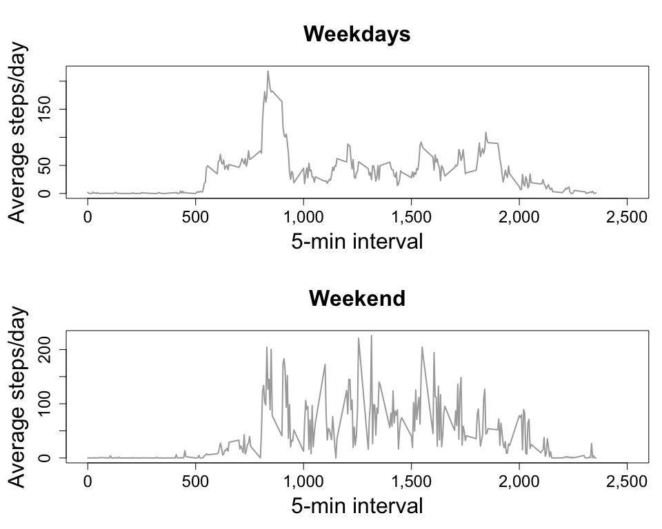

## Loading and preprocessing the data

**Task 1a: Load the data (i.e. read.csv())**


```r
dados <- read.csv("activity.csv", header = T, na.strings = "NA")
```


**Task 1b: Process/transform the data (if necessary) into a format suitable for your analysis**


```r
dados$date <- as.Date(dados$date)
str(dados)
```

```
## 'data.frame':	17568 obs. of  3 variables:
##  $ steps   : int  NA NA NA NA NA NA NA NA NA NA ...
##  $ date    : Date, format: "2012-10-01" "2012-10-01" ...
##  $ interval: int  0 5 10 15 20 25 30 35 40 45 ...
```


## What is mean total number of steps taken per day?

For this part of the assignment, you can ignore the missing values in the dataset.

**Task 2: Make a histogram of the total number of steps taken each day**


```r
dia <- aggregate(steps ~ date, dados, sum)

par(mfrow=c(1,1),mar=c(5,5,5,1), bg = "white")
hist(dia$steps,
     main = "Total number of steps taken each day", 
     xlab = "Number of steps", 
     ylab = "Frequency",
     col = "grey", border = "white",
     cex.axis = 1.5, 
     cex.lab = 2, 
     cex.main = 2,
     xaxt="n")
axis(side=1, at=axTicks(1),
     cex.axis = 1.5,
     labels=formatC(axTicks(1), format="d", big.mark=','))
```


```r
par(mfrow=c(1,1))
```

**Task 3: Calculate and report the mean and median total number of steps taken per day**


```r
media <- round(mean(dia$steps, na.rm = T), 1)
mediana <- round(median(dia$steps, na.rm = T), 1)
```

*Mean = 10,766.2*

*Median = 10,765*


## What is the average daily activity pattern?

**Task 4: Make a time series plot (i.e. type = "l") of the 5-minute interval (x-axis) and the average number of steps taken, averaged across all days (y-axis)**


```r
intervalo <- aggregate(steps ~ interval, dados, mean)

par(mfrow=c(1,1),mar=c(5,5,5,1), bg = "white")
plot(intervalo$steps ~ intervalo$interval,
     type = "l",
     lwd = 2,
     main = "Average number of steps taken each interval", 
     xlab = "5-min interval", 
     xlim = c(0,2500),
     ylab = "Average number of steps/day",
     col = "darkgrey",
     cex.axis = 1.5, 
     cex.lab = 2, 
     cex.main = 2,
     xaxt="n")
axis(side=1, at=axTicks(1),
     cex.axis = 1.5,
     labels=formatC(axTicks(1), format="d", big.mark=','))
```


```r
par(mfrow=c(1,1))
```


**Task 5: Which 5-minute interval, on average across all the days in the dataset, contains the maximum number of steps?**


```r
maximo <- intervalo$interval[which.max(intervalo$steps)]
```

*The interval is 835.*


## Imputing missing values

Calculate and report the total number of missing values in the dataset (i.e. the total number of rows with NAs)


```r
ausentes <- sum(is.na(dados))
```

*The total number of missing values is 2,304.*


Devise a strategy for filling in all of the missing values in the dataset. The strategy does not need to be sophisticated. For example, you could use the mean/median for that day, or the mean for that 5-minute interval, etc.

*1. Merge the complete dataset (**dados**) with the dataset of averages (**intervalo**);*

*2. Replace the missing values in* **dados** *with average values from* **intervalo***;*

*3. Create the new dataset (**dados3**) with only the useful columns;*

*4. Round the values.*
 
**Task 6: Create a new dataset that is equal to the original dataset but with the missing data filled in.**


```r
dados2 <- merge(dados, intervalo, by = "interval")
dados2$steps <- ifelse(is.na(dados2$steps.x), dados2$steps.y, dados2$steps.x)
dados3 <- subset(dados2, select = c(interval, date, steps))
dados3$steps <- round(dados3$steps, 0)
ausentes2 <- sum(is.na(dados3))
```

*There are 0 missing values in the new dataset.*


**Task 7: Make a histogram of the total number of steps taken each day:**


```r
dia2 <- aggregate(steps ~ date, dados3, sum)

par(mfrow=c(1,1),mar=c(5,5,5,1), bg = "white")
hist(dia2$steps,
     main = "Total number of steps taken each day", 
     xlab = "Number of steps", 
     ylab = "Frequency",
     col = "grey", border = "white",
     cex.axis = 1.5, 
     cex.lab = 2, 
     cex.main = 2,
     xaxt="n")
axis(side=1, at=axTicks(1),
     cex.axis = 1.5,
     labels=formatC(axTicks(1), format="d", big.mark=','))
```


```r
par(mfrow=c(1,1))
```


And calculate and report the mean and median total number of steps taken per day. 


```r
media2 <- mean(dia2$steps, na.rm = T)
mediana2 <- median(dia2$steps, na.rm = T)
```

*Mean = 10,765.64*

*Median = 10,762*


Do these values differ from the estimates from the first part of the assignment? 

*Yes, but only slightly.*

*The original mean was 10,766.2, and the modified mean is 10,765.64.*

*The original median was 10,765, and the modified median is 10,762.*


What is the impact of imputing missing data on the estimates of the total daily number of steps?

*The impact is very small, and is noticed mainly in the median, which was higher when missing values were included.*


## Are there differences in activity patterns between weekdays and weekends?

Create a new factor variable in the dataset with two levels -- "weekday" and "weekend" indicating whether a given date is a weekday or weekend day.


```r
dados3$weekdays <- ifelse(weekdays(dados3$date) == c("Domingo", "Sábado"),
                        "weekend", "weekday")
```


**Task 8: Make a panel plot containing a time series plot (i.e. type = "l") of the 5-minute interval (x-axis) and the average number of steps taken, averaged across all weekday days or weekend days (y-axis).**


```r
dados3weekday <- subset(dados3, weekdays == "weekday")
dados3weekend <- subset(dados3, weekdays == "weekend")
intervalo2weekday <- aggregate(steps ~ interval, dados3weekday, mean)
intervalo2weekend <- aggregate(steps ~ interval, dados3weekend, mean)

par(mfrow = c(2, 1), mar=c(5,5,5,1))

plot(intervalo2weekday$steps ~ intervalo2weekday$interval,
     type = "l",
     lwd = 2,
     main = "Weekdays", 
     xlab = "5-min interval", 
     xlim = c(0,2500),
     ylab = "Average steps/day",
     col = "darkgrey",
     cex.axis = 1.5, 
     cex.lab = 2, 
     cex.main = 2,
     xaxt="n")
axis(side=1, at=axTicks(1),
     cex.axis = 1.5,
     labels=formatC(axTicks(1), format="d", big.mark=','))

plot(intervalo2weekend$steps ~ intervalo2weekend$interval,
     type = "l",
     lwd = 2,
     main = "Weekend", 
     xlab = "5-min interval", 
     xlim = c(0,2500),
     ylab = "Average steps/day",
     col = "darkgrey",
     cex.axis = 1.5, 
     cex.lab = 2, 
     cex.main = 2,
     xaxt="n")
axis(side=1, at=axTicks(1),
     cex.axis = 1.5,
     labels=formatC(axTicks(1), format="d", big.mark=','))
```



```r
par(mfrow=c(1,1))
```

